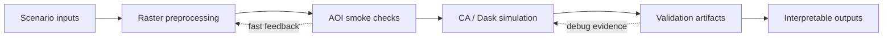

# Hi, I'm Zihao Huang 👋

Geospatial Python engineer building land-cover simulation, raster validation, and scalable spatial modeling workflows.

Currently focused on **🌍 land-cover simulation** · **🛰️ raster workflows** · **⚙️ Dask/PyTorch pipelines**

I work on practical geospatial systems where model behavior, raster correctness, and reproducible validation all matter. My goal is to turn large spatial simulation workflows into inspectable, testable, and reusable Python tools.

## 🧭 Focus

- Scenario-driven land-cover simulation and spatial change modeling
- GeoTIFF validation workflows with AOI-first smoke checks
- Windowed cellular automata over scalable Dask/PyTorch pipelines
- Reproducible artifacts for comparing, debugging, and explaining outputs

## 🛠️ Stack

## 🧩 How I Think About Geospatial Simulation

## 📌 Portfolio Notes

| Area | Problem | Approach | Quality signal |
| --- | --- | --- | --- |
| 🌍 Land-cover simulation workflows | Large scenario runs can hide assumptions and make output changes hard to explain. | Build simulation pipelines with explicit scenario inputs, year-by-year outputs, and inspectable intermediate artifacts. | Reproducible rasters, clear demand assumptions, and comparison-ready outputs. |
| 🛰️ Raster validation and AOI smoke checks | Full-raster checks are expensive, but silent raster regressions are costly. | Validate representative AOI windows first, then scale only when the local evidence is sound. | Fast GeoTIFF triplets, summaries, and focused mismatch analysis. |
| ⚙️ Windowed CA and Dask pipelines | Chunked spatial simulation can introduce boundary behavior and allocation drift. | Trace window demand, CA allocation, and chunk-level artifacts through the real pipeline path. | Boundary-aware diagnostics, scalable execution, and debuggable simulation steps. |

## ✅ What I Value

- Reproducible geospatial workflows over one-off scripts
- Fast localized validation before expensive full-raster runs
- Clear assumptions, typed interfaces, and inspectable artifacts
- Engineering choices that make spatial model behavior easier to explain

## 🤝 Collaboration

I am interested in geospatial simulation, raster processing, and reliable Python tooling for spatial data workflows.

- GitHub: [@ZihaoNova](https://github.com/ZihaoNova)
- Project issues and discussions will be linked here as public repositories are published.
